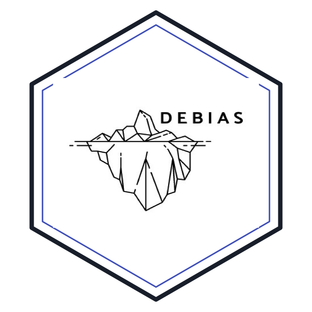
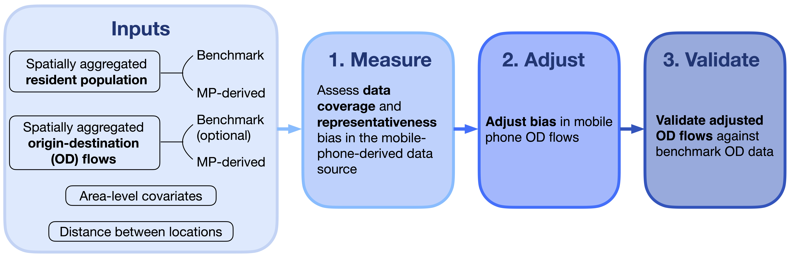

[](#contributors-)
<!-- ALL-CONTRIBUTORS-BADGE:START - Do not remove or modify this section -->




## Overview

`debiasR` is an R package for assessing and correcting population
representation bias in digital trace data. The package is part of the
[DEBIAS project](https://de-bias.github.io/debias/) and links to the
wider [DEBIAS GitHub organisation](https://github.com/de-bias). It is
designed to work with spatio-temporally aggregated data that provide
population counts by location and flows between locations.

The package workflow supports assessment of coverage and
representativeness bias in population counts, adjustment of biased
origin-destination (OD) flows and validation of adjusted flows against benchmark data.
Mobile-phone-derived mobility data are used to illustrate the package
functions in these vignettes, but the same logic can apply to other
digital trace sources with comparable spatial and temporal aggregation
and a validation target. Examples include trade of goods, Internet
traffic, supply chains and other location-to-location flows.


## Installation

Install the development version of `debiasR` from GitHub:

```r
pak::pak("de-bias/debiasR")
```

Alternatively, install with `remotes` instead:

```r
remotes::install_github("de-bias/debiasR")
```

Install the empirical data companion when you need to reproduce the examples in the vignettes:

```r
pak::pak("de-bias/debiasRdata")
```

The same installation is available with `remotes`:

```r
remotes::install_github("de-bias/debiasRdata")
```

Then load the package and follow the walkthroughs in the package documentation or
the source files in `vignettes/`.


## Workflow




## Repository structure

- `R/` - package functions and internal helpers
- `data/` - lightweight simulated datasets retained for tests and compatibility
- `data-raw/` - development scripts; historical raw calibration CSVs are not distributed
- `man/` - generated documentation for exported objects
- `tests/` - `testthat` tests
- `vignettes/` - package-facing Quarto vignettes built into the documentation site
- `notes/` - project briefs, migration notes, workshop material, and status tracking
- `style/` - plotting and Quarto styling helpers
- `.github/` - issue and pull request templates
- `assets/` - logos and other static assets
- `CONTRIBUTING.md` - contribution guidance
- `NEWS.md` - release notes and migration notes
- `LICENSE` - licensing information
- `README.md` - package overview and usage instructions


## License

This repository uses a dual-licensing approach:

- **MIT License** for all software code (see [LICENSE](LICENSE))
- **Creative Commons Attribution 4.0 International (CC BY 4.0)** for documentation, data, and non-code content (see [LICENSE-CC-BY-4.0.md](LICENSE-CC-BY-4.0.md))

See the [LICENSE](LICENSE) file for full details.


## Core development team

The core development team consists of **Francisco Rowe** and **Carmen Cabrera** (University of Liverpool).  

We actively maintain and develop the package and warmly invite contributions from the wider research community — including new methods, bug reports, feature requests and ideas for improvement.

If you’re interested in collaborating or contributing, please join our growing open-source community.


## Contributing

We welcome contributions of all kinds: code, documentation, issues, examples and methodological ideas.
All changes to `main` are made through pull requests. Please read
[CONTRIBUTING.md](CONTRIBUTING.md) for the current workflow, branch naming
guidance and pull request templates.


## Acknowledging contributors

We use the [All Contributors Bot](https://allcontributors.org/) to recognise everyone’s work—code, docs, ideas, design and more.  

After your PR is merged, comment on an issue or PR:

```
@all-contributors please add @your-username for code, doc, etc.
```
(Replace `@your-username` and the contribution types as appropriate.)
See the [emoji key](https://allcontributors.org/en/reference/emoji-key/) for available contribution types.

Thank you for helping us build open, collaborative and impactful projects with DEBIAS!

<!-- ALL-CONTRIBUTORS-LIST:START - Do not remove or modify this section -->
<!-- prettier-ignore-start -->
<!-- markdownlint-disable -->
<table>
  <tbody>
    <tr>
      <td align="center" valign="top" width="14.28%"><a href="http://franciscorowe.com"><br /><sub><b>Francisco Rowe</b></sub></a><br /><a href="https://github.com/de-bias/debiasR/commits?author=fcorowe" title="Documentation">📖</a> <a href="https://github.com/de-bias/debiasR/commits?author=fcorowe" title="Code">💻</a> <a href="https://github.com/de-bias/debiasR/issues?q=author%3Afcorowe" title="Bug reports">🐛</a> <a href="#content-fcorowe" title="Content">🖋</a> <a href="#design-fcorowe" title="Design">🎨</a> <a href="#example-fcorowe" title="Examples">💡</a> <a href="#ideas-fcorowe" title="Ideas, Planning, & Feedback">🤔</a> <a href="#infra-fcorowe" title="Infrastructure (Hosting, Build-Tools, etc)">🚇</a> <a href="#maintenance-fcorowe" title="Maintenance">🚧</a> <a href="#platform-fcorowe" title="Packaging/porting to new platform">📦</a> <a href="#projectManagement-fcorowe" title="Project Management">📆</a> <a href="#research-fcorowe" title="Research">🔬</a> <a href="https://github.com/de-bias/debiasR/pulls?q=is%3Apr+reviewed-by%3Afcorowe" title="Reviewed Pull Requests">👀</a> <a href="#tool-fcorowe" title="Tools">🔧</a> <a href="https://github.com/de-bias/debiasR/commits?author=fcorowe" title="Tests">⚠️</a></td>
      <td align="center" valign="top" width="14.28%"><a href="https://c-cabrera.com/"><br /><sub><b>Carmen Cabrera</b></sub></a><br /><a href="https://github.com/de-bias/debiasR/commits?author=carmen-cabrera" title="Documentation">📖</a> <a href="https://github.com/de-bias/debiasR/commits?author=carmen-cabrera" title="Code">💻</a> <a href="https://github.com/de-bias/debiasR/issues?q=author%3Acarmen-cabrera" title="Bug reports">🐛</a> <a href="#content-carmen-cabrera" title="Content">🖋</a> <a href="#design-carmen-cabrera" title="Design">🎨</a> <a href="#example-carmen-cabrera" title="Examples">💡</a> <a href="#ideas-carmen-cabrera" title="Ideas, Planning, & Feedback">🤔</a> <a href="#infra-carmen-cabrera" title="Infrastructure (Hosting, Build-Tools, etc)">🚇</a> <a href="#maintenance-carmen-cabrera" title="Maintenance">🚧</a> <a href="#platform-carmen-cabrera" title="Packaging/porting to new platform">📦</a> <a href="#projectManagement-carmen-cabrera" title="Project Management">📆</a> <a href="#research-carmen-cabrera" title="Research">🔬</a> <a href="https://github.com/de-bias/debiasR/pulls?q=is%3Apr+reviewed-by%3Acarmen-cabrera" title="Reviewed Pull Requests">👀</a> <a href="#tool-carmen-cabrera" title="Tools">🔧</a> <a href="https://github.com/de-bias/debiasR/commits?author=carmen-cabrera" title="Tests">⚠️</a></td>
    </tr>
  </tbody>
</table>

<!-- markdownlint-restore -->
<!-- prettier-ignore-end -->

<!-- ALL-CONTRIBUTORS-LIST:END -->

This project follows the [all-contributors](https://github.com/all-contributors/all-contributors) specification. Contributions of any kind welcome!
