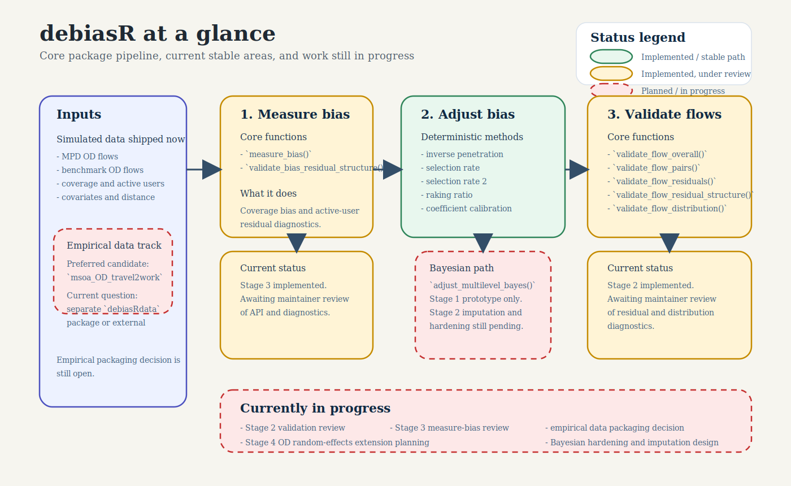

[](#contributors-)
<!-- ALL-CONTRIBUTORS-BADGE:START - Do not remove or modify this section -->
[](#contributors-)
<!-- ALL-CONTRIBUTORS-BADGE:END -->


# debiasR R Package Repository

Welcome to the **debiasR** repository. This package is part of the **DEBIAS** project, an international research initiative focused on understanding and correcting biases in human mobility data derived from mobile phone records.

The package provides tools to generate correction factors for origin-destination mobility estimates so researchers can work with bias-adjusted mobility data in demographic, policy, and scientific applications.

Current exported functions:

- `debiasR_example_data()`
- `measure_bias()`
- `adjust_inverse_penetration()`
- `adjust_selection_rate()`
- `adjust_selection_rate2()`
- `adjust_raking_ratio()`
- `adjust_coefficient()`
- `adjust_multilevel_bayes()` (experimental stage-1 prototype)
- `validate_bias_residual_structure()`
- `validate_flow_overall()`
- `validate_flow_pairs()`
- `validate_flow_residuals()`
- `validate_flow_residual_structure()`
- `validate_flow_distribution()`

Legacy aliases retained temporarily for compatibility:

- `validate_flow_benchmark()` -> `validate_flow_overall()`
- `validate_flow_all()` -> `validate_flow_pairs()`

The package supports inverse penetration weighting, selection-rate models,
raking ratio adjustment, coefficient calibration, and a Bayesian multilevel
adjustment path for OD flows. The Bayesian path is the main methodological
innovation and now supports an explicit complete-grid prediction scope for
square OD matrices, while still requiring careful runtime and dependency
validation.

## Package At A Glance

`debiasR` has three main components:

1. `Measure bias`
- quantify coverage bias between benchmark population and active-user counts
- diagnose spatial, benchmark-flow, covariate, and population-trend structure
  in bias residuals

2. `Adjust bias`
- use `adjust_multilevel_bayes()` as the central multilevel adjustment model
- compare against deterministic OD-flow correction baselines

3. `Validate adjusted flows`
- compare adjusted flows against benchmark OD flows
- assess residual reduction, residual structure, and destination-allocation fidelity

Current progress:

- deterministic adjustment methods are transparent baselines and comparators
- Stage 2 validation diagnostics are maintainer-reviewed and stable
- Stage 3 measure-bias diagnostics are maintainer-reviewed and stable,
  including a population-only linear residual diagnostic
- the Bayesian method now has observed and complete-grid prediction scopes, but
  full empirical Bayesian vignette rendering still depends on Bayesian
  dependencies and real OD distance inputs
- Stage 4 origin-destination random-effects extension is still planned
- empirical examples can now use the optional companion
  [`debiasRdata`](https://github.com/de-bias/debiasRdata) package



For a slightly fuller coauthor-oriented summary, see [notes/project-management/COAUTHOR_PACKAGE_OVERVIEW.md](notes/project-management/COAUTHOR_PACKAGE_OVERVIEW.md).

---

## 👥 Core Development Team

The core development team consists of **Francisco Rowe** and **Carmen Cabrera** (University of Liverpool).  
We actively maintain and develop the package and warmly invite contributions from the wider research community — including new methods, bug reports, feature requests, and ideas for improvement.

If you’re interested in collaborating or contributing, please join our growing open-source community.

---

## 🚀 Getting Started

1. Install and load the package from this checkout.
2. Explore the documentation in `R/` and `man/`.
3. Install the optional empirical data companion when you need the MSOA
   travel-to-work examples:

```r
remotes::install_github("de-bias/debiasRdata")
```

4. Try the empirical MSOA travel-to-work examples through `debiasRdata` and the
   walkthroughs in `vignettes/`.

Default example data:

- MPD travel-to-work OD flows: `msoa_OD_travel2work` from `debiasRdata`
- Census benchmark OD flows: `census_msoa_OD_travel2work`, the matching
  Census 2021 `ODWP01EW` MSOA workplace-flow extract in `debiasRdata`
- Real MSOA OD distance is not included yet; empirical Bayesian rendering still
  falls back to `distance_source = "not_available"` until `debiasRdata` adds it.
- Package helper: `debiasR_example_data()`, which normalises both sources to
  `origin`, `destination`, and `flow`, can return strict square complete-grid OD
  support, and derives the example coverage table from matched origin totals

```r
if (requireNamespace("debiasRdata", quietly = TRUE)) {
  ex <- debiasR_example_data(n_areas = Inf, complete_grid = TRUE)
  msoa_OD_travel2work <- ex$msoa_OD_travel2work
  census_msoa_OD_travel2work <- ex$census_msoa_OD_travel2work
  coverage <- ex$coverage
}
```

Small simulated datasets are still shipped for lightweight testing and backwards
compatibility:

- `simulated_mpd.od`
- `simulated_benchmark.od`
- `simulated_coverage`
- `simulated_covariates`
- `simulated_distance`
- `simulated_active.users`
- `simulated_pop`

The `data-raw/` folder contains the scripts used to build those datasets.

---

## 🛠️ Contributing

We welcome contributions of all kinds: code, documentation, issues, examples, and methodological ideas.
Please read [CONTRIBUTING.md](CONTRIBUTING.md) for the current workflow, branch naming guidance, and pull request templates.

---

## 🙋 License

This repository uses a dual-licensing approach:

- **MIT License** for all software code (see [LICENSE](LICENSE))
- **Creative Commons Attribution 4.0 International (CC BY 4.0)** for documentation, data, and non-code content

See the [LICENSE](LICENSE) file for full details.

---

## 🗂️ Repository Structure

- `R/` - package functions and internal helpers
- `data/` - lightweight simulated datasets retained for tests and compatibility
- `data-raw/` - scripts for rebuilding simulated data and extracting empirical benchmarks
- `man/` - generated documentation for exported objects
- `tests/` - `testthat` tests
- `vignettes/` - empirical `debiasRdata` walkthroughs and comparison notebooks
- `notes/` - project briefs, migration notes, and status tracking
- `style/` - plotting and Quarto styling helpers
- `.github/` - issue and pull request templates
- `assets/` - logos and other static assets
- `CONTRIBUTING.md` - contribution guidance
- `NEWS.md` - release notes and migration notes
- `LICENSE` - licensing information
- `README.md` - package overview and usage instructions

### Stable vs Prototype

Most deterministic helpers are intended for regular use. `adjust_multilevel_bayes()` is the main methodological innovation and now includes an explicit complete-grid prediction scope, but the Bayesian path remains dependency- and runtime-sensitive and should be validated carefully before production use. For the current stability summary, see [notes/project-management/STATUS.md](notes/project-management/STATUS.md).

The repository now separates the main deterministic workflow from the Bayesian prototype so that contributors can focus on the stable API first and treat the Bayesian path as experimental until it is fully hardened.

## 🎉 Acknowledging Contributors

We use the [All Contributors Bot](https://allcontributors.org/) to recognise everyone’s work—code, docs, ideas, design and more.  
After your PR is merged, comment on an issue or PR:

```
@all-contributors please add @your-username for code, doc, etc.
```
(Replace `@your-username` and the contribution types as appropriate.)
See the [emoji key](https://allcontributors.org/docs/en/emoji-key) for available contribution types.

Thank you for helping us build open, collaborative and impactful projects with DEBIAS!

<!-- ALL-CONTRIBUTORS-LIST:START - Do not remove or modify this section -->
<!-- prettier-ignore-start -->
<!-- markdownlint-disable -->
<table>
  <tbody>
    <tr>
      <td align="center" valign="top" width="14.28%"><a href="http://franciscorowe.com"><br /><sub><b>Francisco Rowe</b></sub></a><br /><a href="https://github.com/de-bias/debiasR/commits?author=fcorowe" title="Documentation">📖</a> <a href="https://github.com/de-bias/debiasR/commits?author=fcorowe" title="Code">💻</a> <a href="https://github.com/de-bias/debiasR/issues?q=author%3Afcorowe" title="Bug reports">🐛</a> <a href="#content-fcorowe" title="Content">🖋</a> <a href="#design-fcorowe" title="Design">🎨</a> <a href="#example-fcorowe" title="Examples">💡</a> <a href="#ideas-fcorowe" title="Ideas, Planning, & Feedback">🤔</a> <a href="#infra-fcorowe" title="Infrastructure (Hosting, Build-Tools, etc)">🚇</a> <a href="#maintenance-fcorowe" title="Maintenance">🚧</a> <a href="#platform-fcorowe" title="Packaging/porting to new platform">📦</a> <a href="#projectManagement-fcorowe" title="Project Management">📆</a> <a href="#research-fcorowe" title="Research">🔬</a> <a href="https://github.com/de-bias/debiasR/pulls?q=is%3Apr+reviewed-by%3Afcorowe" title="Reviewed Pull Requests">👀</a> <a href="#tool-fcorowe" title="Tools">🔧</a> <a href="https://github.com/de-bias/debiasR/commits?author=fcorowe" title="Tests">⚠️</a></td>
    </tr>
  </tbody>
</table>

<!-- markdownlint-restore -->
<!-- prettier-ignore-end -->

<!-- ALL-CONTRIBUTORS-LIST:END -->


## Contributors ✨

Thanks goes to these wonderful people ([emoji key](https://allcontributors.org/docs/en/emoji-key)):

<!-- ALL-CONTRIBUTORS-LIST:START - Do not remove or modify this section -->
<!-- prettier-ignore-start -->
<!-- markdownlint-disable -->
<!-- markdownlint-restore -->
<!-- prettier-ignore-end -->
<!-- ALL-CONTRIBUTORS-LIST:END -->

This project follows the [all-contributors](https://github.com/all-contributors/all-contributors) specification. Contributions of any kind welcome!
