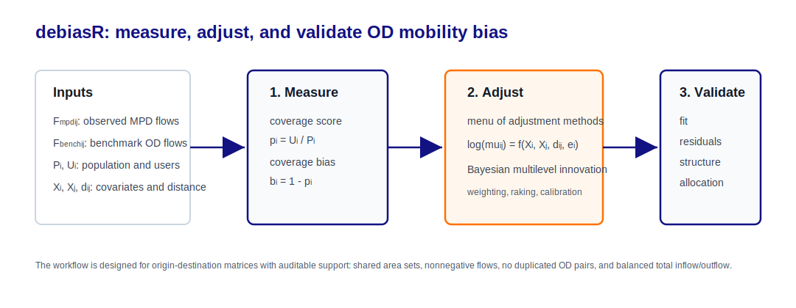

{width="260px"}

## Overview

`debiasR` is an R package for assessing and correcting population
representation bias in digital trace data. The package is part of the
[DEBIAS project](https://de-bias.github.io/debias/) and links to the
wider [DEBIAS GitHub organisation](https://github.com/de-bias). It is
designed to work with spatio-temporally aggregated data that provide
population counts by location and flows between locations.

The package workflow supports measurement of coverage and
representativeness bias in population counts, adjustment of biased
origin-destination (OD) flows using deterministic and Bayesian methods,
and validation of adjusted flows against benchmark data.
Mobile-phone-derived mobility data are used to illustrate the package
functions in these vignettes, but the same logic can apply to other
digital trace sources with comparable spatial and temporal aggregation
and a validation target. Examples include trade of goods, Internet
traffic, supply chains and other location-to-location flows.

The central aim is to estimate bias-adjusted OD flows:

$$
F^{trace}_{ij} \rightarrow F^{adj}_{ij}
$$

where $F^{trace}_{ij}$ is the observed digital-trace-derived flow from
origin $i$ to destination $j$, and $F^{adj}_{ij}$ is the adjusted flow.
In the mobile-phone-derived running example, this observed flow is
written as $F^{mpd}_{ij}$. When benchmark flow data are available,
$F^{bench}_{ij}$ provides an external validation target.


## Installation

`debiasR` is currently available as a development package from GitHub.
You can install it with `pak`:

```r
# install.packages("pak")
pak::pak("de-bias/debiasR")
```

The empirical examples in these vignettes use the optional `debiasRdata`
package, which provides mobile-phone-derived travel-to-work flows derived from Locomizer data and benchmark inputs from the UK 2021 Census. The Locomizer data is openly available via the Zenodo dataset [*Anonymised human location data for urban mobility research*](https://zenodo.org/records/13327082) (Zhong, 2024).  You can install it from GitHub in the same way:

```r
pak::pak("de-bias/debiasRdata")
```

After installation, load `debiasR` with:

```r
library(debiasR)
```

If you want to work directly with the example datasets, you can also load the data package:

```r
library(debiasRdata)
```


## Data requirements

The workflow links two data structures.

First, it requires an area-level population count table, where each row
describes a location, a benchmark population and an observed digital
trace population. This table is used to assess coverage and
representativeness bias.

Second, it requires an OD-flow table, where each row represents movement
from an origin area $i$ to a destination area $j$. These flows are
adjusted using the bias information derived from the population counts.
If benchmark OD flows are available, they can also be used to validate
the adjusted flows.

The benchmark population does not have to come only from a census. It
can also come from administrative data, gridded population datasets or
another suitable reference source. Benchmark OD flows are often harder
to obtain, so the package separates bias assessment in population counts
from validation of adjusted OD flows.

## Workflow



The tutorial sequence follows three stages.

1.  Measure coverage and representativeness bias in the
    mobile-phone-derived OD source.
2.  Adjust bias, with `adjust_multilevel_bayes()` as the main
    methodological innovation and deterministic methods as transparent
    baselines.
3.  Validate adjusted OD flows against benchmark OD data using
    complementary fit, residual, structure and allocation metrics.

## Notation

The vignettes use the same notation throughout:

-   $i$: origin or area identifier
-   $j$: destination identifier
-   $P_i$: benchmark population for area $i$
-   $U_i$: observed digital trace population for area $i$
-   $p_i = U_i / P_i$: coverage score
-   $b_i = 1 - p_i$: coverage bias
-   $\bar{p} = \sum_i U_i / \sum_i P_i$: global coverage score
-   $e_i = p_i - \bar{p}$: coverage-score residual
-   $F^{trace}_{ij}$: observed digital-trace-derived OD flow
-   $F^{mpd}_{ij}$: observed mobile-phone-derived OD flow in the running
    example
-   $F^{bench}_{ij}$: benchmark OD flow
-   $F^{adj}_{ij}$: adjusted OD flow

## Vignette map

1.  Landing page and workflow overview
2.  Why biased mobile-phone-derived mobility data matter
3.  Getting set up with `debiasR` and `debiasRdata`
4.  Measuring coverage bias
5.  Identifying and explaining bias
6.  Adjusting bias, centred on the Bayesian multilevel model
7.  Validating adjusted OD flows
8.  Describing the package example data
